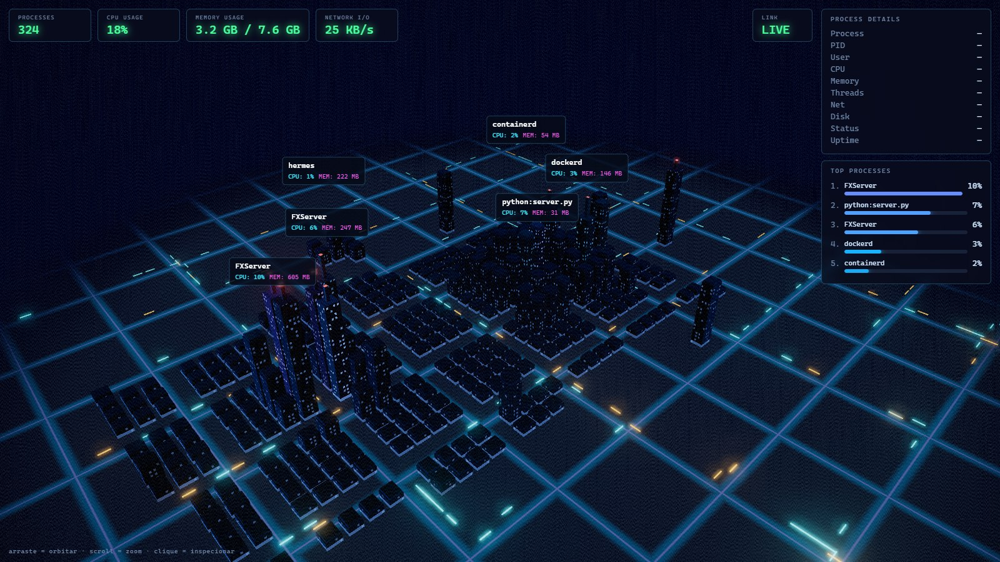

# Process City

Visualização 3D ao vivo dos processos da máquina como uma cidade: cada processo é um prédio, a altura reflete memória, a cor reflete CPU, o brilho das janelas reflete atividade geral e o tráfego nas ruas reflete I/O de rede do host.



*Um servidor Debian real: as torres altas são os FXServer, o tapete de blocos baixos são as threads de kernel, e as luzes vermelhas piscando são balizas nos mastros das torres.*

Composto por dois pedaços:

- **agent/** — coletor Python (psutil) que amostra os processos do host e transmite snapshots via WebSocket.
- **web/** — frontend Vite + TypeScript + three.js que renderiza a cidade a partir desses snapshots.

## Arquitetura

### agent/collector.py

Amostra os processos via `psutil` e calcula todos os deltas (CPU, I/O/s, rede/s) no próprio servidor — o frontend só consome números prontos, nunca faz conta em cima do snapshot.

Detalhes de implementação:

- Duas passagens por amostra: a primeira é barata (PID + RSS + CPU%) e roda para todos os processos vivos; só o topo (`top_n`, ordenado por CPU e depois RSS) recebe a segunda passagem, mais cara (threads, status, I/O de disco, rede).
- Atributos estáticos (nome, usuário, `create_time`) são cacheados por PID, já que nunca mudam enquanto o processo vive.
- Os campos caros (`threads`, `status`) só são renovados a cada `slow_every` amostras (padrão: 4).
- Processos com RSS abaixo de `min_rss` (512 KB) são ignorados como ruído.
- Threads de kernel (`[kworker]`, `[ksoftirqd]`…) têm RSS 0 e ficam de fora por padrão. Num servidor típico elas são ~80% dos PIDs (medido: 254 de 323 no host de teste), então a flag `--kthreads` as inclui como um tapete de blocos baixos em volta das torres — sem elas a cidade fica rala.
- Nomes opacos são resolvidos pela cmdline: `ld-musl-x86_64.so.1` vira `FXServer`, `python` vira `python:server.py`, `java` vira `java:app.jar` (ou o nome da classe principal). Flags que consomem valor (`-cp`, `-classpath`, `-m`…) são puladas, senão o valor de `-cp` viraria o nome do processo.
- O campo `sample_ms` no snapshot expõe quanto tempo a coleta levou.

### agent/server.py

- WebSocket (porta padrão `8765`) faz broadcast de 1 snapshot por segundo para todos os clientes conectados.
- Opcionalmente serve o build estático do frontend via `http.server` rodando em uma thread separada (`--static DIR --http-port N`).
- A coleta roda em `asyncio.to_thread` — em processos numerosos ela pode levar segundos (principalmente no Windows) e travaria o handshake dos clientes se rodasse direto no event loop.
- O intervalo entre amostras é adaptativo: o loop de broadcast nunca dorme menos que `interval - tempo_da_coleta`, ou seja, nunca amostra mais rápido do que a máquina aguenta.

### web/

Vite + TypeScript + three.js. Pontos centrais:

- Todos os prédios são um único `THREE.InstancedMesh` — a cidade inteira (até 1200 prédios) é desenhada em 1 draw call. Cor e atividade por prédio viajam como atributos de instância (`aTint`, `aActivity`), lidos num `onBeforeCompile` que injeta o shader de janelas.
- Mais duas camadas instanciadas, também 1 draw call cada: **coroas/mastros** (torre acima de 17 unidades ganha mastro fino com baliza vermelha piscando; prédio baixo ganha casa de máquinas) e **poças de luz** (disco aditivo no asfalto, raio e força ligados à atividade).
- Fachada: janelas em coordenada de mundo (tamanho constante independente da escala do prédio), andar técnico a cada 7 pavimentos para quebrar a grade perfeita, térreo sempre aceso.

#### Pipeline de render

`RenderTarget multisample (4x)` → `RenderPass` → `GTAOPass` → `UnrealBloomPass` → `GradeShader` → `OutputPass`

- O alvo precisa ser multisample explicitamente: `antialias: true` no renderer não vale nada quando o `EffectComposer` desenha num render target próprio.
- O `GTAOPass` monta o g-buffer com `scene.overrideMaterial`, ou seja, renderiza tudo. Geometria aditiva (poças, tráfego) não tem superfície real e só sujaria o buffer de normais — ela é escondida durante essa passagem por um wrapper em volta de `gtao.render`.
- AO com raio curto (1.0) e mistura fraca (0.4) de propósito: numa malha densa o AO ocluiria tudo, e o pass aplica a oclusão também sobre o emissivo das janelas.
- `GradeShader` (`web/src/grade.ts`): vinheta, saturação e grão discreto.
- Domo de gradiente no fundo: contra preto chapado a silhueta da cidade não tem contra-forma.
- Sem agent rodando, o frontend cai automaticamente num gerador sintético (ver [Sem agent](#sem-agent-rodando)).

## Mapeamento visual

| Elemento | Fonte | Regra |
|---|---|---|
| 1 prédio | 1 processo | `agent/collector.py` envia 1 entrada por PID selecionado |
| Altura | RSS (memória residente) | `log10(RSS_MB + 1) * 7.8 + 1.5` — escala logarítmica, senão um processo de 4 GB esmaga o resto da cidade |
| Cor | CPU% | rampa azul → ciano → roxo → rosa → laranja, com curva perceptual `sqrt(cpu / 100)` (a maioria dos processos vive abaixo de 5% de CPU, então uma curva linear jogaria quase tudo no início da rampa) |
| Glow / janelas acesas | CPU + I/O + rede | `atividade = cpu_norm * 0.62 + io_norm * 0.2 + net_norm * 0.18`, com piso de 32% de janelas acesas mesmo em atividade zero (processo ocioso ainda parece um prédio habitado, só não pulsa) |
| Tráfego nas ruas | I/O de rede do host | densidade e velocidade das partículas seguem o throughput total; ciano (`#7ef2ff`) = download (rx), âmbar (`#ffc871`) = upload (tx) |

Rampa de cor completa (`web/src/city.ts`):

| t (cpu_norm) | Cor |
|---|---|
| 0.00 | `#1a6fc4` (azul) |
| 0.18 | `#17b6ff` (ciano) |
| 0.45 | `#8b4dff` (roxo) |
| 0.70 | `#ff3fb0` (rosa) |
| 1.00 | `#ff8a2b` (laranja) |

## Layout (web/src/layout.ts)

O ponto crítico da visualização é **estabilidade espacial**: o prédio de um PID não pode pular de lugar entre snapshots, senão a cidade "ferve" e vira ruído visual a cada segundo.

Para isso:

- Grade fixa de **61x61 células**, com uma rua a cada 5 células (`BLOCK = 5`, ou seja, 4 lotes + 1 rua).
- Cada usuário ganha uma **âncora determinística** calculada por hash do nome (posição polar), formando distritos — `root`/`SYSTEM` ficam no centro (downtown), usuários comuns nos anéis externos.
- Um processo novo pega o **lote livre mais próximo da âncora do seu usuário** (busca em anéis concêntricos a partir da âncora).
- O lote só volta para o pool **quando o processo morre** — nunca é realocado enquanto o processo está vivo.

## Protocolo

Um snapshot é um objeto JSON, transmitido por WebSocket a cada `--interval` segundos (compactado, sem espaços). Campos (`agent/collector.py` / `web/src/types.ts`):

```ts
interface Snapshot {
  t: number;      // epoch (segundos)
  host: Host;
  procs: Proc[];
}

interface Host {
  procs: number;      // total de processos vivos na máquina
  shown: number;       // quantos vieram neste snapshot (<= --top)
  cpu: number;          // CPU% do host inteiro
  ncpu: number;         // núcleos lógicos
  mem_used: number;     // bytes
  mem_total: number;    // bytes
  net_rx: number;       // bytes/s, download total do host
  net_tx: number;       // bytes/s, upload total do host
  boot: number;         // epoch do boot
  sample_ms?: number;   // custo da coleta deste snapshot, em ms
}

interface Proc {
  pid: number;
  name: string;
  user: string;
  cpu: number;      // % (pode passar de 100 em multi-core)
  rss: number;       // bytes
  threads: number;
  status: string;
  uptime: number;    // segundos
  conns: number;     // conexões inet abertas
  io: number;        // bytes/s de disco (leitura + escrita)
  net: number;        // bytes/s de rede
}
```

Exemplo real de um snapshot:

```json
{
  "t": 1755000000.12,
  "host": {
    "procs": 287,
    "shown": 250,
    "cpu": 14.3,
    "ncpu": 16,
    "mem_used": 12897345536,
    "mem_total": 34215288832,
    "net_rx": 182340.5,
    "net_tx": 51022.1,
    "boot": 1754890000.0,
    "sample_ms": 42
  },
  "procs": [
    {
      "pid": 4821,
      "name": "node",
      "user": "app",
      "cpu": 37.2,
      "rss": 512483328,
      "threads": 11,
      "status": "running",
      "uptime": 38211,
      "conns": 6,
      "io": 102400.0,
      "net": 30420.7
    }
  ]
}
```

## Como rodar

### Local (dev)

```bash
cd agent
python -m venv .venv
.venv/Scripts/python -m pip install -r requirements.txt
.venv/Scripts/python server.py
```

```bash
cd web
npm install
npm run dev
```

Abre em `http://localhost:5173`. O frontend acha o agent em `ws://<hostname>:8765` por padrão; para apontar para outro host, use a querystring `?ws=ws://outro-host:8765`.

`agent/requirements.txt` fixa versões mínimas: `psutil>=5.9`, `websockets>=12.0`.

### Docker (Linux)

```bash
docker compose up -d --build
```

- UI em `http://<host>:8099`, WebSocket em `8765`.
- `pid: host` — sem isso o container só enxerga o próprio processo Python e a cidade teria 1 prédio.
- `network_mode: host` — contadores de rede reais da máquina e portas expostas sem NAT.
- Somente leitura: `cap_drop: [ALL]`, `cap_add: [SYS_PTRACE]` apenas para conseguir ler `/proc/<pid>/io` de processos de outros usuários. Nada no projeto mata ou altera processo algum.
- `/etc/passwd` e `/etc/group` montados read-only: sem eles o psutil resolve os UIDs contra o passwd do container e todo usuário vira número (`1000` em vez de `deploy`).
- A UI vai na `8099` porque com `network_mode: host` a `8080` costuma já estar ocupada (Portainer, txAdmin e cia). Se a porta estiver tomada, o agent avisa no log e segue servindo só o WebSocket.
- O `Dockerfile` builda o frontend (`node:22-alpine`) e copia o resultado para dentro da imagem do agent (`python:3.12-slim`, `psutil==7.*`, `websockets==15.*`), que serve tudo — UI e WebSocket — em um único container.

### Sem agent rodando

O frontend detecta a ausência do agent (sem resposta em 1.5s) e cai automaticamente num gerador sintético (`web/src/mock.ts`), que simula processos nascendo/morrendo e variação de CPU/memória/rede. O indicador `LINK` no HUD mostra `DEMO` nesse modo, em vez de `LIVE`.

## Controles

| Ação | Efeito |
|---|---|
| Arrastar | Orbitar a câmera |
| Scroll | Zoom |
| Clique num prédio | Inspecionar o processo (detalhes no HUD) |
| Barra de espaço | Liga/desliga a câmera automática |

Querystrings:

| Parâmetro | Efeito |
|---|---|
| `?ws=ws://host:8765` | aponta para outro agent |
| `?zoom=0.5` | aproxima a câmera automática (telão/kiosk) |
| `?fx=low` | desliga o AO, a passagem mais cara do pipeline |

## Limitações reais

- **Rede por processo não existe em `/proc` de forma direta.** O coletor usa duas estratégias:
  - processos em net-namespace próprio (containers Docker/LXC, pods) têm contadores reais e isolados, lidos de `/proc/<pid>/net/dev`;
  - processos no netns do host têm o tráfego total da máquina **distribuído proporcionalmente ao número de conexões abertas** de cada um — isso é estimativa, não medição. Medição real por processo exigiria eBPF.
- **Custo de coleta no Windows.** Uma passagem ingênua do psutil com ~400 processos leva ~10s (`num_threads()` e `status()` abrem um handle por processo, ~3,3s cada). Por isso o coletor faz duas passagens (só o top N recebe os campos caros), cacheia atributos estáticos por PID e renova threads/status a cada 4 amostras. O campo `sample_ms` no snapshot expõe esse custo (aparece no tooltip do indicador `LINK` no HUD).
- **`psutil.net_connections` precisa de privilégio** para ver conexões de outros usuários; sem isso, a contagem de conexões (`conns`) fica parcial.
- **Contadores de netns são do namespace, não do processo.** Todos os processos de um mesmo container reportam o mesmo tráfego (o do container inteiro).
- **Teto de instâncias.** O frontend instancia no máximo 1200 prédios (`MAX` em `web/src/city.ts`). O agent limita quantos processos manda por snapshot via `--top` (default 250; o `docker-compose.yml` usa 400 junto com `--kthreads`).
